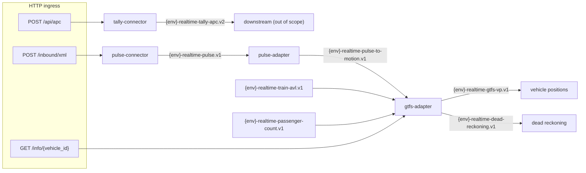

# Omnia Exemplar

A reference implementation for building [omnia](https://github.com/augentic/omnia)
services. It models a fictional transit operator ("Acme") that consolidates
realtime vehicle data processing into WASM guests: SOAP/XML position feeds,
passenger counting, and GTFS realtime adaptation.

The same domain logic is exposed through **two guest styles, side by side**, so
you can compare the typed `omnia-guest` API with hand-written Axum handlers and
pick the style that fits your service.

## Quick start

```shell
# build both guests
cargo build --target wasm32-wasip2 --release

# run one of them with its example host runtime
cp guests/typed/examples/.env.example .env   # then fill in values
set -a; source .env; set +a
cargo run -p guest-typed --example typed-runner -- run target/wasm32-wasip2/release/guest_typed.wasm
```

Substitute `guest-axum` / `axum-runner` / `guest_axum.wasm` to run the
Axum-style guest — both serve identical routes and topics.

## Architecture



Two shapes of service repeat throughout the pipeline:

- **Connector** — thin ingress: decode the transport payload, validate it,
  key it, and publish it to a topic. No enrichment, no state.
  `tally-connector` is the minimal template; `pulse-connector` adds a
  vendor-specific (SOAP/XML) transport.
- **Adapter** — domain transformation: validate, enrich via upstream APIs,
  maintain state, and publish derived events. `pulse-adapter` is a compact
  example; `gtfs-adapter` is the full-size one.

Start a new service from the closest template.

## The two guest styles

**Prefer style A (typed).** It is the least code and the hardest to get
wrong. Drop to style B only when you need transport-level control the typed
router does not give you: custom extractors, middleware, response shaping, or
messaging dispatch that doesn't fit the router.

### Style A — typed routers (`guests/typed`)

Routes bind an `Operation` directly to a path or topic; the router handles
transport decoding, invocation, and response projection:

- `omnia_guest::api::http::Router` with `get::<Op, P>()` / `post::<Op, P>()`
- `omnia_guest::api::messaging::Router` with `consume::<Op>()`, plus
  `decode_with` for non-JSON payloads (the Pulse XML feed)
- Non-JSON HTTP ingress drops down to the underlying Axum router
  (`router.into_axum()`) for a single hand-written route

### Style B — plain Axum (`guests/axum`)

Hand-written Axum handlers served through `omnia_wasi_http::serve`, and a raw
`incoming-handler` messaging export that matches on exact topic. Each handler
decodes its own payload and invokes the shared operation through an `Invoker`.

### What both share

- Domain logic lives in `crates/*` as `Operation<P>` implementations; the
  guests are thin routing layers over the same operations.
- Routes and topics come from the canonical tables in
  `acme_common::routes`, so the two styles serve the same surface by
  construction.
- A unit `Provider` struct with the WASI-backed default capability
  implementations (`Config`, `HttpRequest`, `Identity`, `Publish`,
  `StateStore`).
- `wasip3::http::service::export!` + `omnia_wasi_messaging::export!` exports,
  with `#[omnia_wasi_otel::instrument]` on the entry handlers.
- A native host-runner example (`examples/runner.rs`) built with
  `omnia::runtime!`.

## Routes and topics

| HTTP route | Operation |
| --- | --- |
| `POST /api/apc` | `tally_connector::TallyRequest` — passenger-count ingress |
| `POST /inbound/xml` | `pulse_connector::PulseRequest` — SOAP/XML position ingress |
| `GET /info/{vehicle_id}` | `gtfs_adapter::VehicleInfoRequest` |
| `POST /god-mode/set-trip/{vehicle_id}/{trip_id}` | `gtfs_adapter::SetTripRequest` (requires the `god-mode` feature) |

| Messaging topic | Operation |
| --- | --- |
| `{env}-realtime-pulse.v1` | `pulse_adapter::PulseMessage` (XML) |
| `{env}-realtime-pulse-to-motion.v1` | `gtfs_adapter::MotionMessage` |
| `{env}-realtime-train-avl.v1` | `gtfs_adapter::TrainAvlMessage` |
| `{env}-realtime-passenger-count.v1` | `gtfs_adapter::PassengerCountMessage` |

`POST /api/apc` publishes to `{env}-realtime-tally-apc.v2`; its downstream
consumer is out of scope for the exemplar.

## Crate map

| Crate | Role |
| --- | --- |
| `crates/common` (`acme-common`) | Config key catalog, canonical route/topic tables, and shared clients for the Block Management and Fleet APIs |
| `crates/pulse-connector` | HTTP ingress for the vendor "Pulse" SOAP/XML position feed; republishes to messaging |
| `crates/pulse-adapter` | Converts Pulse train updates into Motion location events |
| `crates/tally-connector` | HTTP ingress for the vendor "Tally" passenger-count feed |
| `crates/gtfs-adapter` | Converts Motion events into GTFS-realtime vehicle positions |
| `guests/typed` | Style A guest binary |
| `guests/axum` | Style B guest binary |

Domain crates depend only on the `omnia-guest` capability traits (`Config`,
`HttpRequest`, `Identity`, `Publish`, `StateStore`), so the same code runs
inside the WASM guest and against native mock providers in tests.

## Adding a new operation

1. Pick a template: `tally-connector` for a connector, `pulse-adapter` for an
   adapter.
2. Create the crate under `crates/`, register it in the workspace
   `Cargo.toml` under `# Internally referenced crates`.
3. Implement the input type and `Operation<P>` with the narrowest capability
   bounds it needs (e.g. `P: Provider + Config + Publish`).
4. Add any new topic suffix or HTTP path to `acme_common::routes`, and any
   new configuration key to `acme_common::config` plus both guest
   `.env.example` files.
5. Wire the operation into **both** guests from the shared route tables
   (`guests/typed/src/lib.rs` and `guests/axum/src/lib.rs`).
6. Add fixtures under the crate's `data/` and native tests under `tests/`
   with a mock provider (copy the shape of `crates/tally-connector/tests` or
   `crates/gtfs-adapter/tests`).
7. Run `make ci` — fmt, clippy (native + wasm), tests, docs, vet, deny.

## Configuration

All keys are declared as constants in `acme_common::config`; the guest
`.env.example` files carry sample values.

| Key | Used by | Purpose |
| --- | --- | --- |
| `ENV` | all publishers/consumers | Deployment environment; prefixes every topic (`dev-…`). Defaults to `dev` with a warning when unset |
| `BLOCK_MGT_URL` | gtfs-adapter, pulse-adapter | Block Management API base URL |
| `FLEET_URL` | gtfs-adapter | Fleet API base URL |
| `TRIP_MANAGEMENT_URL` | gtfs-adapter | Trip Management API base URL |
| `STATIC_API_URL` | pulse-adapter | Static GTFS API base URL |
| `API_IDENTITY` | gtfs-adapter, pulse-adapter | Identity used to acquire access tokens for the operator APIs |
| `GOD_MODE_ENABLED` | gtfs-adapter | Runtime switch for the god-mode override (also requires the `god-mode` build feature) |

## State keys

The gtfs-adapter keeps its pipeline state under the `motionGtfs:` prefix,
namespaced by purpose then identifier — see `crates/gtfs-adapter/src/state_keys.rs`
for the full catalog and key builders. God-mode overrides live under a
separate `god_mode:` prefix so operational overrides never mix with pipeline
state.

## Copy this, not that

Patterns worth copying into new services:

- `Operation<P>` domain logic behind capability traits, with guests as thin
  routing layers.
- One canonical route/topic table (`acme_common::routes`) consumed by
  producers, consumers, and both guests.
- Named config keys with a single documented resolution policy
  (`acme_common::config`).
- Native mock-provider tests plus captured fixtures (`tests/` +
  `data/` in each crate).

Acme domain quirks that are **not** general patterns:

- **Duplicate publish** — `pulse-adapter` publishes each Motion event twice
  (`PUBLISH_REPEATS`) because a downstream schedule-adherence process needs
  the repeat. The legacy system also spaced the repeats with a blocking
  sleep; that was removed — never block a WASM guest.
- **God-mode** — an operational override tool, off by default behind the
  `god-mode` cargo feature and the `GOD_MODE_ENABLED` config key. Not part of
  a production pipeline.
- **SOAP fault in `bad_request!`** — `pulse-connector` returns a pre-rendered
  XML fault because the vendor protocol demands it. Prefer plain structured
  errors unless a wire protocol dictates otherwise.
- **UTC as the local timezone** — `acme_common::TIMEZONE` is UTC to keep
  fixtures reproducible. A real operator sets its actual IANA zone.
- **Legacy reply fields** — `VehicleInfoReply::pid` and
  `SetTripReply::process` are always `0`, retained only to match the legacy
  reply shapes.

## Testing

```shell
cargo nextest run            # or: cargo test --workspace --all-features
```

- `crates/tally-connector/tests` — the minimal mock-provider pattern
- `crates/pulse-connector/tests` — SOAP happy path and fault sad path
- `crates/gtfs-adapter/tests` — in-memory `Config`/`StateStore`/`Publish`/
  `HttpRequest` mocks covering motion, dead reckoning, sign-on, filtering,
  occupancy, and (feature-gated) god-mode
- `crates/pulse-adapter/tests` — static fixtures plus `augentic-test` replay
  sessions captured from a live system (`data/replay`, `data/static`)

## Guest template contract

This repository is the source of truth for the reusable Omnia guest
tooling. [`templates/guest/`](templates/guest/) carries the tokenized
base-repo templates ([contract and authoring rules](templates/guest/README.md)),
and [`exemplar.yaml`](exemplar.yaml) declares the exact Omnia
`{ version, repository, rev }` this repository is green against — the
`[patch.crates-io]` entries in `Cargo.toml` pin the same rev.

The Emery omnia target adapter vendors `templates/guest/` byte-for-byte
and directs consumer build agents to a fresh checkout of `main` as the
worked-code reference. **Merges to `main` are therefore release acts**:
the CI gate (including the template contract check below) is required
on merge, not advisory, because downstream consumers track `main`
unpinned.

The contract is enforced by the `template-check` gate, which runs
inside the standard test suite and stand-alone:

```shell
cargo run -p template-check   # schema, tokens, render, root render-diff
```

`exact` templates must byte-match their repository-root counterparts —
the root files are the rendered output of the template subtree, so a
green root vouches for the templates. To change a tooling convention,
edit the template and the root file in the same commit. To move to a
new Omnia rev: update `exemplar.yaml`, the `[patch.crates-io]` revs,
and `Cargo.lock` together; `template-check` fails on any disagreement.

## Development

```shell
make ci         # fmt, clippy (native + wasm), test, docs, vet, deny — same targets as omnia
```

The workspace follows omnia's conventions: stable toolchain
(`rust-toolchain.toml`, with the `wasm32-wasip2` target), edition 2024,
workspace lints, `cargo vet` supply-chain audits (`supply-chain/`), and CI as
thin wrappers over the reusable workflows in `augentic/.github`.

The omnia crates are currently resolved from the GitHub monorepo via the
`[patch.crates-io]` section in `Cargo.toml`, pending publication to a public
registry.
