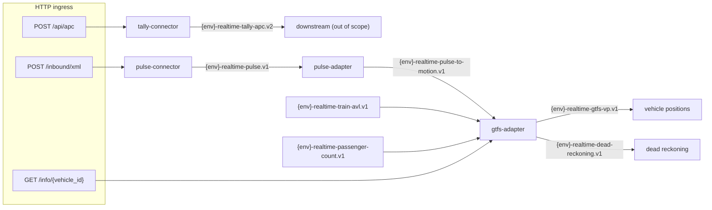

# Omnia Exemplar

A reference implementation for building [omnia](https://github.com/augentic/omnia)
services. It models a fictional transit operator ("Acme") that consolidates
realtime vehicle data processing into a WASM guest: SOAP/XML position feeds,
passenger counting, and GTFS realtime adaptation.

Domain logic lives under `crates/*` as `#[omnia_guest::operation]` handler
functions (each derives its `Operation<P>` impl). The **guest is the
workspace root package** (`src/lib.rs`) — hand-written Axum HTTP handlers
and exact-topic messaging over a shared `Invoker`. Match this layout when
creating a new Omnia service: root `src/`, not a `guests/<name>/` tree.

Typed `omnia_guest::api` HTTP / messaging routers are a documented fallback
in the Emery omnia target adapter only; this repository does not ship a
compiling typed guest.

## Relation to omnia

This repository is the application-scale complement to the
[omnia](https://github.com/augentic/omnia) runtime's per-capability
[`examples/`](https://github.com/augentic/omnia/tree/main/examples): one real
service instead of twenty snippets. The guest is built on the `omnia-guest`
SDK (`Operation<P>` domain logic behind capability traits) and exercises
`wasi:http`, `wasi:messaging`, `wasi:keyvalue`, `wasi:config`,
`wasi:identity`, and — via `crates/capability-examples` — blobstore,
websocket broadcast, docstore, and SQL. The example host
(`examples/runtime.rs`) is a single `omnia::runtime!` invocation running
against the in-tree default backends; swapping in production backends from
[omnia-backends](https://github.com/augentic/omnia-backends) is a host-side
change only (see the omnia
[Production Backends guide](https://github.com/augentic/omnia/blob/main/docs/guides/production-backends.md)).
The omnia crates are resolved from the GitHub monorepo via
`[patch.crates-io]` in `Cargo.toml`; `Cargo.lock` records the exact
revision.

## Quick start

```shell
# build the guest
cargo build --target wasm32-wasip2 --release

# run it with the example host runtime
cp .env.example .env   # then fill in values
set -a; source .env; set +a
cargo run --example runtime -- run target/wasm32-wasip2/release/guest.wasm
```

## Architecture



Two shapes of service repeat throughout the pipeline:

- **Connector** — thin ingress: decode the transport payload, validate it,
  key it, and publish it to a topic. No enrichment, no state.
  `tally-connector` is the minimal template; `pulse-connector` adds a
  vendor-specific (SOAP/XML) transport.
- **Adapter** — domain transformation: validate, enrich via upstream APIs,
  maintain state, and publish derived events. `pulse-adapter` is a compact
  example; `gtfs-adapter` is the full-size one.

Start a new service from the closest template.

## Guest packaging

The root `Cargo.toml` is both the workspace and the deployable guest package
(`name = "guest"`, `crate-type = ["cdylib"]`). Workspace members are
`crates/*` (plus `templates/check` for the template gate). There is no
`guests/` directory.

The guest:

- Serves hand-written Axum handlers through `omnia_wasi_http::serve`
- Exports messaging with `omnia_wasi_messaging::export!`, matching **exact**
  env-qualified topics
- Uses a unit `Provider` declared with `omnia_guest::provider!`, giving it
  the WASI-backed default capability impls (`Config`, `HttpRequest`,
  `Identity`, `Publish`, `StateStore`)
- Invokes domain operations through a shared `Invoker`
- Ships a native host example at `examples/runtime.rs` via `omnia::runtime!`

## Routes and topics

| HTTP route | Operation |
| --- | --- |
| `POST /api/apc` | `tally_connector::TallyRequest` — passenger-count ingress |
| `POST /inbound/xml` | `pulse_connector::PulseRequest` — SOAP/XML position ingress |
| `GET /info/{vehicle_id}` | `gtfs_adapter::VehicleInfoRequest` |
| `POST /god-mode/set-trip/{vehicle_id}/{trip_id}` | `gtfs_adapter::SetTripRequest` (requires the `god-mode` feature) |

| Messaging topic | Operation |
| --- | --- |
| `{env}-realtime-pulse.v1` | `pulse_adapter::PulseMessage` (XML) |
| `{env}-realtime-pulse-to-motion.v1` | `gtfs_adapter::MotionMessage` |
| `{env}-realtime-train-avl.v1` | `gtfs_adapter::TrainAvlMessage` |
| `{env}-realtime-passenger-count.v1` | `gtfs_adapter::PassengerCountMessage` |

`POST /api/apc` publishes to `{env}-realtime-tally-apc.v2`; its downstream
consumer is out of scope for the exemplar.

## Crate map

| Crate | Role |
| --- | --- |
| `crates/common` (`acme-common`) | Config key catalog, canonical route/topic tables, and shared clients for the Block Management and Fleet APIs |
| `crates/pulse-connector` | HTTP ingress for the vendor "Pulse" SOAP/XML position feed; republishes to messaging |
| `crates/pulse-adapter` | Converts Pulse train updates into Motion location events |
| `crates/tally-connector` | HTTP ingress for the vendor "Tally" passenger-count feed |
| `crates/gtfs-adapter` | Converts Motion events into GTFS-realtime vehicle positions |
| `crates/capability-examples` | Domain-free operations proving the remaining capabilities: `BlobStore`, `Broadcast`, `DocumentStore`, `TableStore` |
| `crates/pattern-examples` | Composition patterns: decode-through-cache, config-carried client certificates, and relational geo queries through the ORM |
| root package (`guest`) | Axum + exact-topic WASM guest binary |

Domain crates depend only on the `omnia-guest` capability traits (`Config`,
`HttpRequest`, `Identity`, `Publish`, `StateStore`; `capability-examples`
covers `BlobStore`, `Broadcast`, `DocumentStore`, and `TableStore`), so the
same code runs inside the WASM guest and against native mock providers in
tests.

## Adding a new operation

1. Pick a template: `tally-connector` for a connector, `pulse-adapter` for an
   adapter.
2. Create the crate under `crates/`, register it in the workspace
   `Cargo.toml` under `# Internally referenced crates`.
3. Implement the input type and an `#[omnia_guest::operation]` handler fn
   (`async fn name<P>(input: Input, context: CallContext<'_, P>) -> Result<Reply>`)
   with the narrowest capability bounds it needs
   (e.g. `P: Provider + Config + Publish`).
4. Add any new topic suffix or HTTP path to `acme_common::routes`, and any
   new configuration key to `acme_common::config` plus `.env.example`.
5. Wire the operation into `src/lib.rs` from the shared route tables.
6. Add fixtures under the crate's `data/` and native tests under `tests/`
   with a mock provider (copy the shape of `crates/tally-connector/tests` or
   `crates/gtfs-adapter/tests`).
7. Run `make ci` — fmt, clippy (native + wasm), tests, docs, vet, deny.

## Configuration

All keys are declared as constants in `acme_common::config`; `.env.example`
carries sample values.

| Key | Used by | Purpose |
| --- | --- | --- |
| `ENV` | all publishers/consumers | Deployment environment; prefixes every topic (`dev-…`). Defaults to `dev` with a warning when unset |
| `BLOCK_MGT_URL` | gtfs-adapter, pulse-adapter | Block Management API base URL |
| `FLEET_URL` | gtfs-adapter | Fleet API base URL |
| `TRIP_MANAGEMENT_URL` | gtfs-adapter | Trip Management API base URL |
| `STATIC_API_URL` | pulse-adapter | Static GTFS API base URL |
| `API_IDENTITY` | gtfs-adapter, pulse-adapter | Identity used to acquire access tokens for the operator APIs |
| `GOD_MODE_ENABLED` | gtfs-adapter | Runtime switch for the god-mode override (also requires the `god-mode` build feature) |
| `PATTERN_DECODER_URL` | pattern-examples | Decoder endpoint for the decode-through-cache example |
| `PATTERN_CLIENT_CERT` | pattern-examples | Client certificate forwarded to the decoder as a `Client-Cert` header |

## State keys

The gtfs-adapter keeps its pipeline state under the `motionGtfs:` prefix,
namespaced by purpose then identifier — see `crates/gtfs-adapter/src/state_keys.rs`
for the full catalog and key builders. God-mode overrides live under a
separate `god_mode:` prefix so operational overrides never mix with pipeline
state.

## Copy this, not that

Patterns worth copying into new services:

- `Operation<P>` domain logic behind capability traits, with the guest as a
  thin routing layer at the **workspace root** (`src/lib.rs`).
- One canonical route/topic table (`acme_common::routes`) consumed by
  producers, consumers, and the guest.
- Named config keys with a single documented resolution policy
  (`acme_common::config`).
- Native mock-provider tests plus captured fixtures (`tests/` +
  `data/` in each crate).
- Decode-through-cache: expensive lookups go through `StateStore` in one
  operation — miss → `Config` → `HttpRequest` → write back with a TTL —
  instead of a separate cache-population process
  (`pattern_examples::decode`).
- Credential material in `Config`, carried as ordinary request data (the
  `Client-Cert` header), so outbound HTTP stays generic.
- Spy mocks: the test provider records outbound HTTP requests so tests
  assert on what left the guest — shape, headers, and call count
  (`crates/pattern-examples/tests/provider.rs`).
- Radius queries as bounding-box `SELECT`s through `TableStore` and the
  ORM, refined by haversine in Rust — never a geospatial extension bolted
  onto the KV state store (`pattern_examples::place`).

Acme domain quirks that are **not** general patterns:

- **Duplicate publish** — `pulse-adapter` publishes each Motion event twice
  (`PUBLISH_REPEATS`) because a downstream schedule-adherence process needs
  the repeat. The legacy system also spaced the repeats with a blocking
  sleep; that was removed — never block a WASM guest.
- **God-mode** — an operational override tool, off by default behind the
  `god-mode` cargo feature and the `GOD_MODE_ENABLED` config key. Not part of
  a production pipeline.
- **SOAP fault in `bad_request!`** — `pulse-connector` returns a pre-rendered
  XML fault because the vendor protocol demands it. Prefer plain structured
  errors unless a wire protocol dictates otherwise.
- **UTC as the local timezone** — `acme_common::TIMEZONE` is UTC to keep
  fixtures reproducible. A real operator sets its actual IANA zone.
- **Legacy reply fields** — `VehicleInfoReply::pid` and
  `SetTripReply::process` are always `0`, retained only to match the legacy
  reply shapes.

## Testing

```shell
cargo nextest run            # or: cargo test --workspace --all-features
```

- `crates/tally-connector/tests` — the minimal mock-provider pattern
- `crates/pulse-connector/tests` — SOAP happy path and fault sad path
- `crates/gtfs-adapter/tests` — in-memory `Config`/`StateStore`/`Publish`/
  `HttpRequest` mocks covering motion, dead reckoning, sign-on, filtering,
  occupancy, and (feature-gated) god-mode
- `crates/pulse-adapter/tests` — static fixtures plus `acme-test` replay
  sessions captured from a live system (`data/replay`, `data/static`)
- `crates/capability-examples/tests` — one in-memory mock provider covering
  `BlobStore`/`Broadcast`/`DocumentStore`/`TableStore`
- `crates/pattern-examples/tests` — a spy mock provider that records
  outbound HTTP requests, covering the decode cache (hit and miss) and the
  ORM-backed nearby query

## Guest template contract

This repository is the source of truth for the reusable Omnia guest
tooling. [`templates/guest/manifest.yaml`](templates/guest/manifest.yaml)
maps repository files to consumer scaffold targets
([contract and authoring rules](templates/guest/README.md)).

The Emery omnia target adapter directs each consumer build to a fresh
checkout of `main` and reads the contract from that checkout at build
time: `exact` manifest entries are the repository-root files
themselves, and seed baselines live under `templates/guest/core/`.
There is no vendored or baked-in copy anywhere. **Merges to `main` are
therefore release acts**: the CI gate (including the template contract
check below) is required on merge, not advisory, because downstream
consumers track `main` unpinned.

The adapter pins an exact `schema-version` for
`templates/guest/manifest.yaml`. Bumping that version here requires a
coordinated adapter release, or consumer builds fail closed at the
scaffold prelude.

The contract is enforced by the `template-check` gate, which runs
inside the standard test suite and stand-alone:

```shell
cargo run -p template-check   # schema, tokens, path safety, seed render
```

`exact` entries reference their repository-root file in place
(`source == target`, token-free), so a green root vouches for the
scaffold with no diff to maintain. To move to a new Omnia rev, update
`Cargo.lock` (and any explicit `rev` on the `[patch.crates-io]` git
sources).

## Development

```shell
make ci         # fmt, clippy (native + wasm), test, docs, vet, deny — same targets as omnia
```

The workspace follows omnia's conventions: stable toolchain
(`rust-toolchain.toml`, with the `wasm32-wasip2` target), edition 2024,
workspace lints, `cargo vet` supply-chain audits (`supply-chain/`), and CI as
thin wrappers over the reusable workflows in `augentic/.github`.

The omnia crates are currently resolved from the GitHub monorepo via the
`[patch.crates-io]` section in `Cargo.toml`, pending publication to a public
registry.
